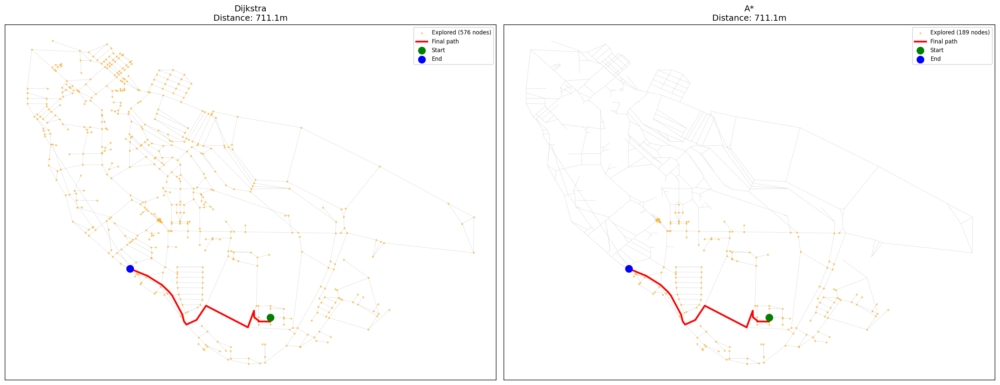

# Campus/City Route Finder — Dijkstra vs A*

A pathfinding engine that computes shortest routes on **real-world street networks** pulled from OpenStreetMap, implemented in C++ for performance and benchmarked against a Python-based data/visualization pipeline.

The project implements **Dijkstra's algorithm** and **A\*** from scratch (no shortest-path libraries), compares their performance on real map data, and visualizes the search behavior of each algorithm side by side.


<!-- Replace with your actual comparison.png once generated -->

---

## Why this project

Most "Dijkstra implementations" online run on toy graphs with 5–10 nodes. This one runs on a real street network with thousands of nodes/edges pulled from OpenStreetMap, and includes:

- A from-scratch binary-heap Dijkstra implementation (`O((V+E) log V)`)
- A from-scratch A\* implementation using the Haversine formula as an admissible heuristic
- Measured proof (not just claims) that A\* explores fewer nodes than Dijkstra while returning the **exact same shortest distance**
- A visual, side-by-side comparison of what each algorithm actually explores before finding the destination

---

## Results

On ["Cairo University campus network"] (**576 nodes**, **827 edges**):

| Algorithm | Time (ms) | Nodes Explored | Distance (m) |
|-----------|-----------|----------------|---------------|
| Dijkstra  | 1.81 ms   | 576            | 711.06 m      |
| A\*       | 0.634 ms  | 189            | 711.06 m      |

> Both algorithms return the exact same shortest distance, confirming the A\* heuristic is admissible. A\* reaches the destination after exploring significantly fewer nodes, since it's guided toward the goal instead of expanding uniformly in every direction like Dijkstra.

### Visual comparison

The image below shows every node each algorithm visited (orange) before finding the final path (red), on the same source/destination pair:

- **Dijkstra** expands roughly uniformly in *every* direction from the source.
- **A\*** stays concentrated in a narrow corridor toward the destination.


---

## Architecture

The project is split by responsibility: Python handles data acquisition and visualization (where mature libraries already exist), while C++ handles the performance-critical graph algorithms.

```
├── data/
│   ├── fetch_osm_data.py      # Pulls a real street network from OpenStreetMap via OSMnx
│   └── graph_data.json        # Exported graph: nodes (id, lat, lng) + edges (from, to, distance)
│
├── src/
│   ├── Graph.h / .cpp             # Adjacency-list graph + node coordinates
│   ├── Dijkstra.h / .cpp          # Dijkstra's algorithm (binary heap)
│   ├── AStar.h / .cpp             # A* with Haversine heuristic
│   ├── PathReconstructor.h / .cpp # Rebuilds a path from a `previous` map
│   └── GraphLoader.h / .cpp       # Parses graph_data.json into a Graph
│
├── visualization/
│   ├── plot_route.py          # Plots a single computed route on the real map
│   └── plot_comparison.py     # Plots Dijkstra vs A* exploration side by side
│
└── main.cpp                   # Entry point: load graph → run algorithm(s) → export results
```

**Data flow:**

```
fetch_osm_data.py → graph_data.json → GraphLoader → Graph
                                                        │
                                        ┌───────────────┴───────────────┐
                                        │                                │
                                    Dijkstra                           A*
                                        │                                │
                                        └───────────────┬───────────────┘
                                                PathReconstructor
                                                          │
                                                    result.json
                                                          │
                                              plot_route.py / plot_comparison.py
```

Python and C++ never call each other directly — they communicate only through JSON files. This keeps each stage independently testable and avoids the complexity of a language binding for a project this size.

---

## How it works

### Dijkstra

Explores nodes greedily by actual distance from the source (`g(n)`), using a min-heap to always expand the closest unvisited node next. Guarantees the shortest path but has no notion of where the destination is, so it explores in every direction equally.

**Complexity:** `O((V + E) log V)` using a binary heap, vs. the naive `O(V²)` array-based version.

### A*

Same core idea as Dijkstra, but ranks nodes by `f(n) = g(n) + h(n)`, where `h(n)` is the straight-line (Haversine) distance from that node to the destination. This biases the search toward the goal instead of expanding uniformly.

**Heuristic used:** Haversine distance (great-circle distance on a sphere), which is *admissible* — it never overestimates the true remaining road distance — since any real road route is always ≥ the straight-line distance between two points. This guarantees A\* still finds the true shortest path, not just *a* path.

Setting `h(n) = 0` for every node makes A\* mathematically identical to Dijkstra — Dijkstra is a special case of A\*.

---

## Data source

Street network data is pulled live from [OpenStreetMap](https://www.openstreetmap.org) using [`OSMnx`](https://github.com/gboeing/osmnx):

```bash
pip install osmnx
python data/fetch_osm_data.py
```

This exports `data/graph_data.json` with real node coordinates and real street-segment distances (in meters), for the region defined in `fetch_osm_data.py`.

---

## Building and running

```bash
# 1. Fetch real map data
python data/fetch_osm_data.py

# 2. Build the C++ project
mkdir build && cd build
cmake ..
make

# 3. Run pathfinding (writes result.json)
./main

# 4. Visualize a single route
python visualization/plot_route.py

# 5. Run the benchmark (Dijkstra vs A*)
./performance_test

# 6. Visualize the side-by-side comparison
python visualization/plot_comparison.py
```

**Dependencies:**
- C++17, [`nlohmann/json`](https://github.com/nlohmann/json) (header-only, included)
- Python 3, `osmnx`, `matplotlib`

---

## Design decisions worth noting

- **Separation of concerns:** `Graph` only knows about connectivity and coordinates — it has no idea Dijkstra or A\* exist. Adding a new algorithm (e.g. Bellman-Ford) requires zero changes to `Graph`.
- **Defensive JSON loading:** malformed or missing OSM data (nodes without coordinates, edges referencing dropped nodes) is filtered out during export rather than crashing the C++ loader.
- **Duplicate heap entries over decrease-key:** since `std::priority_queue` has no `decrease-key`, outdated (stale) entries are pushed again and simply skipped via a `visited` check when popped — simpler than manually implementing decrease-key, with the same asymptotic complexity.

---

## Possible extensions

- [ ] Multi-criteria routing (distance vs. estimated time, using dual edge weights)
- [ ] k-shortest-paths (alternative routes, not just the single best one)
- [ ] Interactive `folium`-based HTML map instead of static `matplotlib` plots
- [ ] REST API wrapper around the C++ engine

---

## Author

**Mohamed Mahmoud Mamdouh**
Computer Science Student, Assiut University
[GitHub](https://github.com/mmohamedmmamdouh6) · [LinkedIn](https://www.linkedin.com/in/mohammed-mahmoud-15660b252/)
